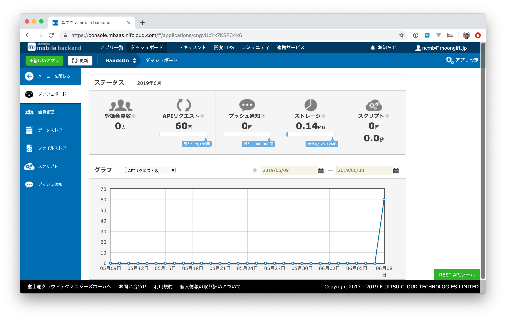
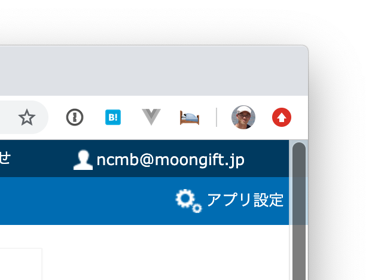
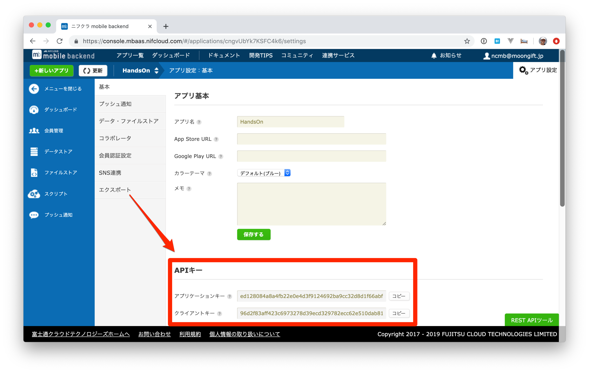

# 第5章 NCMBの設定について

今回、TodoのデータはNCMB（ニフクラ mobile backend）に保存します。すでにアカウントは取得されていることとして、設定について紹介します。

## キーを確認する

NCMBの管理画面にログインします。



そして、右上にあるアプリ設定をクリックします。



アプリ設定の中にAPIキーという項目があります。ここにあるアプリケーションキーとクライアントキーを使います。



## キーを設定する

二つのキーは `todo.js` で指定します。ファイルは `public/js/todo.js` になります。ファイルの最初に下記のように書かれているのを確認してください。

```js
// NCMBのキーを設定します
var applicationKey = 'APPLICATION_KEY';
var clientKey = 'CLIENT_KEY';
```

この中の `APPLICATION_KEY` と `CLIENT_KEY` を上記の管理画面で取得したものを書き換えてください。例えば下記のようにします。

```js
// NCMBのキーを設定します
var applicationKey = 'ed1...1a6';
var clientKey = '96d...0fb';
```

----

これでNCMBを使う準備は完了しました。次に[Todoの表示処理をオフライン対応](6.md)させてみましょう。
