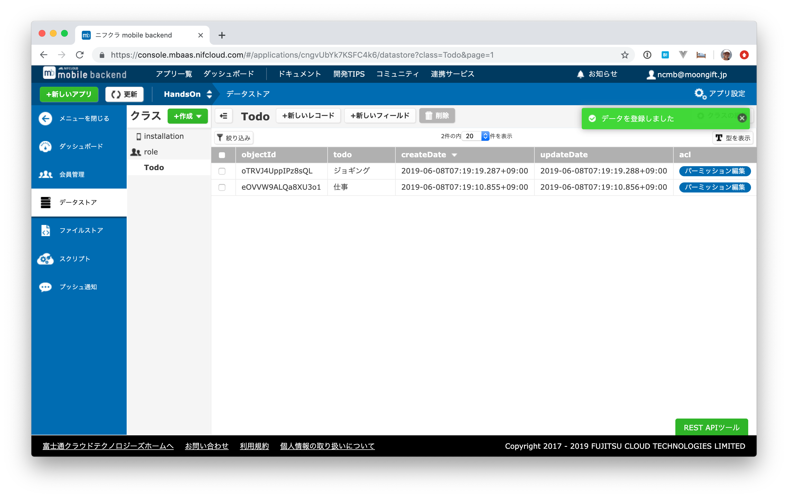

# 第6章 Todoの表示処理をオフライン対応させる

TodoアプリをPWA化させる上で大事なのは以下の3つになるでしょう。

- Todoの表示をオフライン化する
- Todoの登録をオフライン化する
- Todoの削除をオフライン化する

Todoの表示をオフライン化する場合、CACHE APIを使えば簡単に実現できそうな気がします。確かに「一度だけの」キャッシュであれば簡単です。Service Workerはデフォルトではキャッシュの自動更新機能を備えていません。そのため、キャッシュの削除処理を実行しないとキャッシュが更新されません。

そこで今回はTodoの表示をオフライン化させてみます。その際に使えるのが動的なキャッシュ生成です。

## 動的なキャッシュ生成とは

通常Service Worker側でキャッシュを作成する場合、あらかじめURLを決めておいて、それをまとめて登録します。しかしこの方法ではTodoのように動的に内容が変わるものに対応できません。そこでメッセージ機能を使ってWebブラウザのJavaScript（メインスレッド）からService Worker（ワーカースレッド）を呼び出してキャッシュを更新します。

## 処理はTodo登録処理に追加する

ではいつタスクを更新するかと言えば、Todoを登録した際が一番良さそうです。現在のTodo一覧と新しく登録したTodoを追加してService Workerに送ります。 todo.js を開いて、 `// Service Workerのキャッシュを更新します（第6章）` と書かれている場所の下にコードを追加します。

元：

```js
// Service Workerのキャッシュを更新します（第6章）
```

Service Workerにメッセージを送る際には次のようにします。これで Service Workerの `message` というイベントが呼ばれます。

```js
// Service Workerのキャッシュを更新します（第6章）
// todo.jsの中です
const channel = new MessageChannel();
navigator.serviceWorker.controller
  .postMessage({
    url: Url,
    todos: {
      results: me.__todos
    }
}, [channel.port2]);
```

## Service Workerでキャッシュを更新する

キャッシュはURLとそのレスポンスのキー/バリューでしかありませんので、更新は簡単です。sw.jsから `// Todoの一覧を更新する処理（第6章）` と書かれている部分を探して追記します。

```js
// Todoの一覧を更新する処理（第6章）
// sw.jsの中です
self.addEventListener('message', function(event) {
  // キャッシュを開く
  caches.open(CACHE_NAME)
    .then(cache => {
      // 新しいレスポンスを作る
      // レスポンスとともに、レスポンスヘッダーも指定
      const res = new Response(JSON.stringify(event.data.todos), {
        headers: {
          'Content-Type': 'application/json'
        }
      });
      // URLとレスポンスを紐付け
      cache.put(event.data.url, res);
    })
});
```

これでTodoを登録した際のキャッシュ変更が完了します。

## Todo削除時にも同様の処理を行う

Todo削除の際にも `updateView` を呼び出しますので、この時にキャッシュを更新します。

## Todoの登録状態を確認する

Todoがオンラインに反映されているかどうかはNCMBの管理画面で確認できます。データストアの中にTodoというクラスがあり、その中にデータが登録されているのを確認してください。



----

キャッシュを動的に更新することでWeb APIを使ったような動的なコンテンツにも対応できます。では次は[Todoの投稿処理をオフライン対応](./7.md)します。
