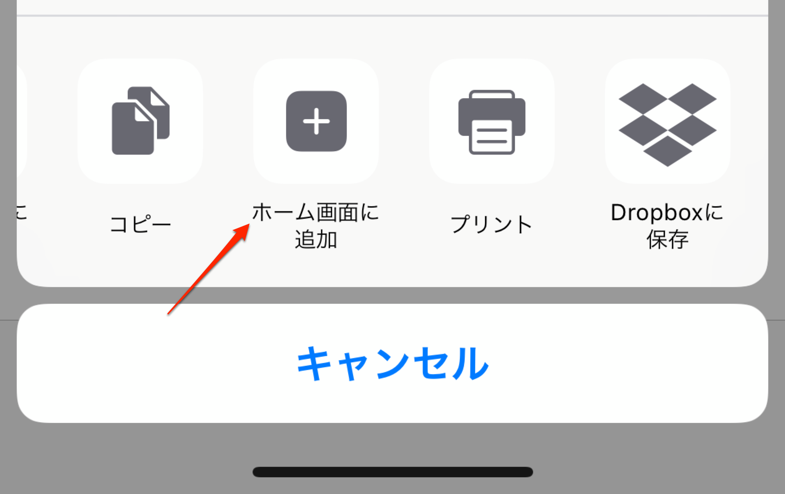

# おまけ：スマートフォンアプリとしてインストールする

ここまで作成してもらったTodoアプリをスマートフォンにインストールする方法を紹介します。こちらはオマケとして試してみてください。

## app.jsに戻す

第8章で `app.push.js` に変更しているはずなので、`app.js` に戻してください。

```html
<script src="js/app.push.js"></script>
　↓
<script src="js/app.js"></script>
```

## Mr2.jsをインストールする

Mr2はローカルの特定のポートをインターネット上に公開してくれるサービスです。

http://localhost:3000/ は立ち上げたまま、別なターミナル（またはコマンドプロンプト）で以下のコマンドを実行してください。

```
npm install -S @txthinking/mr2
```

## コマンドを実行する

Mr2をインストールしたら、下記のコマンドを実行します。

```
npx mr2 -c 127.0.0.1:3000
```

そうすると、以下のようにURLが表示されます。このアドレスをWebブラウザで開くと、 `http://localhost:3000` の内容が表示されるはずです。ポート番号の443は省略可能です。

```
https://92959c6d9cfd449de3174ef558e0f56f.us.mr2.dev:443
```

このアドレスではURLの入力が面倒なので `-D` オプションでサブドメインを指定できます。

```
npx mr2 -c 127.0.0.1:3000 -D hifive
```

そうすると `https://hifive.us.mr2.dev/` でアクセスできるようになります。

## アプリ化を体験する

表示されたアドレスにスマートフォンからアクセスしてみましょう。AndroidまたはiOSで実行します。

### Androidの場合

PWAとしてインストールするか確認するバナー（A2H = Add to Home Screen）は5分以上の時間をおいて、2回目以降のアクセスで表示されます。しかし開発中ではこの状態では不便なので、Google Chromeの設定変更をお勧めします。Androidで `chrome://flags` を開きます。そしてBypass user engagement checksと検索して有効にします。


これで一度目のアクセスでインストールバナーが表示されるようになります。

### iOSの場合

iOSはインストールバナーの表示に対応していませんので、ホーム画面に追加する機能を使ってください。



---

アプリとしてインストールする機能はAndroidの方が分かりやすいでしょう。iOSは今後に期待したいところです。
